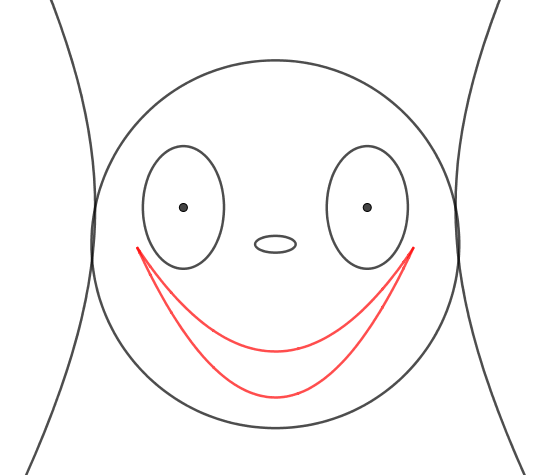

```{r setup, include=FALSE}
# The next command configures MANY things and loads quite a few packages.
#
# If you want to see what's being done, execute
#
#   cat(
#     system.file(
#       "rmarkdown/resources/R/_common_report.R",
#       package = "fnaufelRmd"
#     )
#   )
#
# to find out the location of the file. Then open the file.
#
# If you want to change the configuration, copy the file, edit it, and
# source it instead of the package file.
#
# Or simply write your commands here in this code chunk.

source(
  system.file(
    "rmarkdown/resources/R/_common_report.R",
    package = "fnaufelRmd"
  )
)

library(reticulate)
sympy <- import('sympy')
py_run_string('from sympy import *')
py_run_string('init_printing(use_latex = True)')

py_transformer <- function(text, envir) {

  decimal <- ifelse(
    getOption('OutDec') == ',',
    '"comma"',
    '"period"'
  )

  py_run_string(
    paste0(
      'm_latex = latex(',
      text,
      ', decimal_separator = ',
      decimal,
      ')'
    )
  )

  py$m_latex

}

m <- function(template, asis = getOption('m_asis', FALSE)) {

  f <- ifelse(asis, cat, knitr::asis_output)

  f(
    glue::glue(
      template,
      .open = '{{',
      .close = '}}',
      .transformer = py_transformer
    )
  )

}

```


# Instruções

* Fique à vontade para consultar os coleguinhas e para usar programas como o Geogebra, mas [somente soluções *analíticas* serão aceitas --- nada de responder no olhômetro.]{.hl}

* Uma solução analítica é aquela em que você detalha todos os passos intermediários: [não vale resolver tudo no Geogebra e apresentar o resultado final; é preciso mostrar o passo-a-passo]{.hl}.

* Entregue [(via Moodle)]{.hl} sua resolução escrita no formato que você preferir: manuscrito escaneado ou fotografado, documento gerado via $\LaTeX$ etc. O importante é que a resolução esteja legível. [Se você for fotografar sua resolução, use um aplicativo como [Clear Scan](https://play.google.com/store/apps/details?id=com.indymobileapp.document.scanner) para gerar um resultado melhor.]{.hl}

* Além da resolução por escrito, entregue também [(via Moodle)]{.hl} um arquivo contendo um vídeo de no máximo 5 minutos onde você explica em detalhes a resolução de uma parte da sua questão.

* Bom trabalho.


# Questão única: construindo um emoji com cônicas

Os dados da sua questão dependem do valor de $n$ sorteado para você.

[Veja o seu valor de $n$ nesta lista.](#nums)

Você vai achar equações de cônicas que são o rosto, os olhos, o nariz, a boca e as orelhas de um emoji no $\mathbb{R}^2$.

::: {.rmdimportant}

Em todos os seus cálculos e respostas, [use frações e radicais.]{.hl} 

[Não use valores numéricos com vírgulas decimais em momento algum.]{.hl}

:::

```{r echo=FALSE}
set.seed(12345)

matrícula <- c(
  220060041,
  122060031,
  122060020,
  122060013,
  122060034,
  122060021,
  822060037,
  122060006,
  622060027,
  215060056,
  122060005,
  122060008,
  122060017,
  122060012,
  622060024,
  122060007,
  122060003,
  122060004,
  622060025,
  122060029,
  221060040,
  122060033,
  122060041,
  122060009,
  122060016,
  122060038,
  122060028,
  122060030,
  119060029,
  221060047,
  122060023,
  122060015,
  122060010,
  122060014,
  122060036,
  622060026,
  122060018,
  122060011,
  122060019,
  122060022,
  122060040,
  122060035  
)  

n_alunos <- length(matrícula)
  
n <- sample(1:n_alunos)

df <- tibble(matrícula, n) %>% 
  arrange(n)

# Valores de xc, yc, rc
coords <- expand_grid(
  xc = as.integer(c(-2, -1, 1, 2)),
  yc = as.integer(c(-2, -1, 1, 2)),
  rc = as.integer(1:4)
) %>% 
  slice_sample(n = n_alunos)

df <- cbind(df, coords)
```

```{python echo=FALSE}
x, y = symbols('x, y', real = True)
xc, yc = symbols('x_C, y_C', real = True)
rc = symbols('r_C', real = True, positive = True)
```

Seu emoji vai ficar assim:

```{r echo=FALSE, out.width='50%'}

```


## Rosto

* O [rosto]{.hl} é o [círculo de equação geral dada abaixo]{.hl} ([veja o seu número $n$ nesta lista](#nums)).

* Ache a [equação canônica]{.hl} deste círculo.

    ```{python echo=FALSE}
    eq_face = Eq(xc**2 - 2*xc*x + yc**2 - 2*yc*y + x**2 + y**2 - rc**2, 0)
    
    eqs_face = [
      eq_face.subs({xc: xx, yc: yy, rc: rr}) 
      for (xx, yy, rr) 
      in zip(r.df.xc, r.df.yc, r.df.rc)
    ]
    
    eqs_face_latex = [latex(e) for e in eqs_face]
    ```
    
    ```{r echo=FALSE}
    eqs_face <- paste0(
      '1. $\\displaystyle \\quad ',
      py$eqs_face_latex,
      '$',
      collapse = '\n\n'
    )
    ```
    
    ```{r echo=FALSE}
    m(eqs_face)
    ```


## Nariz

* O [nariz]{.hl} é a [elipse de eixo maior horizontal com as coordenadas do centro, valores de $a$ e de $c$ dados abaixo]{.hl} ([veja o seu número $n$ nesta lista](#nums)).

* Ache a [equação canônica]{.hl} desta elipse.

    ```{python echo=FALSE}
    cnariz = rc / 10
    anariz = cnariz + cnariz / 10
    
    centronarizes = zip(r.df.xc, r.df.yc)
    centronarizes_latex = [latex(e) for e in centronarizes]
    
    cnarizes = [
      cnariz.subs({rc: rr}) for rr in r.df.rc
    ]
    cnarizes_latex = [latex(e) for e in cnarizes]
    
    anarizes = [
      anariz.subs({cnariz: cn}) for cn in cnarizes
    ]
    anarizes_latex = [latex(e) for e in anarizes]
    ```
    
    ```{r echo=FALSE}
    narizes <- paste0(
      '1. $\\displaystyle \\quad \\text{Centro} = ',
      py$centronarizes_latex,
      '\\ ,\\quad a = ',
      py$anarizes_latex,
      '\\ ,\\quad c = ',
      py$cnarizes_latex,
      '$',
      collapse = '\n\n'
    )
    ```
    
    ```{r echo=FALSE}
    m(narizes)
    ```
    

## Olhos

* Os [centros dos olhos]{.hl} são os [focos da elipse com equação geral dada abaixo]{.hl} ([veja o seu número $n$ nesta lista](#nums)).

* Ache a [equação canônica]{.hl} e as [coordenadas dos focos]{.hl} desta elipse.

    ```{python echo=FALSE}
    eq_mascara = Eq(
      80 * (
        (21 * x**(2)) +
        (121 * y**(2)) +
        - ((42 * xc) * x)
        - (((Rational(242, 5) * rc) + (242 * yc)) * y) +
        ((Rational(242, 5) * rc) * yc) +
        (Rational(-121, 80) * rc**(2)) +
        (21 * xc**(2)) +
        (121 * yc**(2))
      ),
      0
    )
    
    eqs_mascara = [
      eq_mascara.subs({xc: xx, yc: yy, rc: rr}) 
      for (xx, yy, rr) 
      in zip(r.df.xc, r.df.yc, r.df.rc)
    ]
    
    eqs_mascara_latex = [latex(e) for e in eqs_mascara]
    ```
    
    ```{r echo=FALSE}
    eqs_mascara <- paste0(
      '1. $\\displaystyle \\quad ',
      py$eqs_mascara_latex,
      '$',
      collapse = '\n\n'
    )
    ```
    
    ```{r echo=FALSE}
    m(eqs_mascara)
    ```

* [Cada olho]{.hl} é uma [elipse de eixo maior vertical com os valores de $a$ e de $c$ dados abaixo]{.hl} ([veja o seu número $n$ nesta lista](#nums)).

* Ache as [equações gerais]{.hl} destas elipses.

    ```{python echo=FALSE}
    colho = rc / 4
    aolho = rc / 3
    
    colhos = [
      colho.subs({rc: rr}) for rr in r.df.rc
    ]
    colhos_latex = [latex(e) for e in colhos]
    
    aolhos = [
      aolho.subs({rc: rr}) for rr in r.df.rc
    ]
    aolhos_latex = [latex(e) for e in aolhos]
    ```
    
    ```{r echo=FALSE}
    olhos <- paste0(
      '1. $\\displaystyle \\quad a = ',
      py$aolhos_latex,
      '\\ ,\\quad c = ',
      py$colhos_latex,
      '$',
      collapse = '\n\n'
    )
    ```
    
    ```{r echo=FALSE}
    m(olhos)
    ```


## Boca

* A [parte superior da boca]{.hl} é uma [parábola com concavidade para cima, com as coordenadas do foco $F$ e a distância focal $p$ dadas abaixo]{.hl} ([veja o seu número $n$ nesta lista](#nums)).

* Ache a [equação canônica]{.hl} desta parábola.

    ```{python echo=FALSE}
    fbocasup = (xc, yc - rc / 3)
    pbocasup = rc / 4
    
    fbocasups = [
      (
        fbocasup[0].subs({xc: xx, yc: yy, rc: rr}),
        fbocasup[1].subs({xc: xx, yc: yy, rc: rr})
      )
      for (xx, yy, rr) 
      in zip(r.df.xc, r.df.yc, r.df.rc)
    ]
    fbocasups_latex = [latex(e) for e in fbocasups]
    
    pbocasups = [
      pbocasup.subs({rc: rr}) for rr in r.df.rc
    ]
    pbocasups_latex = [latex(e) for e in pbocasups]
    ```
    
    ```{r echo=FALSE}
    bocasup <- paste0(
      '1. $\\displaystyle \\quad F = ',
      py$fbocasups_latex,
      '\\ ,\\quad p = ',
      py$pbocasups_latex,
      '$',
      collapse = '\n\n'
    )
    ```
    
    ```{r echo=FALSE}
    m(bocasup)
    ```

* A [parte inferior da boca]{.hl} também é uma [parábola, cuja equação geral é dada abaixo]{.hl} ([veja o seu número $n$ nesta lista](#nums)).

* Ache a [equação canônica]{.hl} desta parábola.

* Ache as coordenadas dos [pontos onde as duas parábolas se interceptam]{.hl} --- i.e., os cantos das bocas.

* No Geogebra, aprenda como [traçar estas duas parábolas]{.hl} apenas na região entre os dois pontos de interseção, para que o traçado da boca não ultrapasse os cantos.

    ```{python echo=FALSE}
    eq_bocainf = Eq(
      -18*rc*y - 15*rc**2 + 26*xc**2 + 26*x**2 + 18*rc*yc - 52*xc*x,
      0
    )
    
    eqs_bocainf = [
      eq_bocainf.subs({xc: xx, yc: yy, rc: rr}) 
      for (xx, yy, rr) 
      in zip(r.df.xc, r.df.yc, r.df.rc)
    ]
    
    eqs_bocainf_latex = [latex(e) for e in eqs_bocainf]
    ```
    
    ```{r echo=FALSE}
    eqs_bocainf <- paste0(
      '1. $\\displaystyle \\quad ',
      py$eqs_bocainf_latex,
      '$',
      collapse = '\n\n'
    )
    ```
    
    ```{r echo=FALSE}
    m(eqs_bocainf)
    ```


## Orelhas

* As [orelhas]{.hl} são os ramos de uma [hipérbole de eixo real          horizontal, de excentricidade $11/10$]{.hl}, cujos [vértices]{.hl} são os [dois pontos do círculo do rosto]{.hl} que têm a [coordenada $y$ igual ao valor abaixo]{.hl} ([veja o seu número $n$ nesta lista](#nums)).

    ```{python echo=FALSE}
    yorelha = yc + rc / 5
    
    yorelhas = [
      yorelha.subs({yc: yy, rc: rr}) for (yy, rr) in zip(r.df.yc, r.df.rc)
    ]
    yorelhas_latex = [latex(e) for e in yorelhas]
    ```
    
    ```{r echo=FALSE}
    orelhas <- paste0(
      '1. $\\displaystyle \\quad y = ',
      py$yorelhas_latex,
      '$',
      collapse = '\n\n'
    )
    ```
    
    ```{r echo=FALSE}
    m(orelhas)
    ```

* Ache a [equação canônica]{.hl} desta hipérbole.


# Números dos alunos, por matrícula { #nums }

```{r echo=FALSE}
df %>% 
  select(matrícula, n) %>% 
  arrange(matrícula) %>% 
  kbl() %>% 
  kable_paper(
    c('striped', 'hover'),
    full_width = FALSE
  )
```

